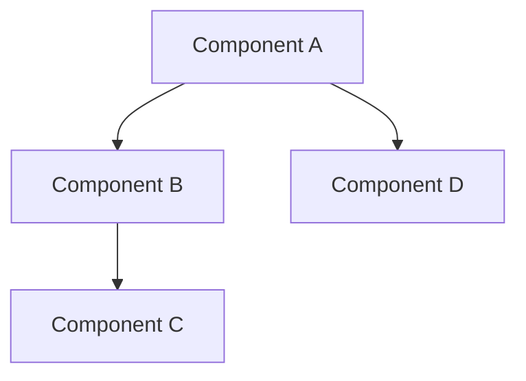
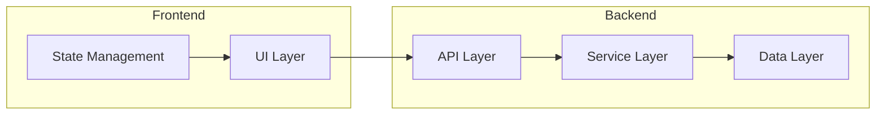
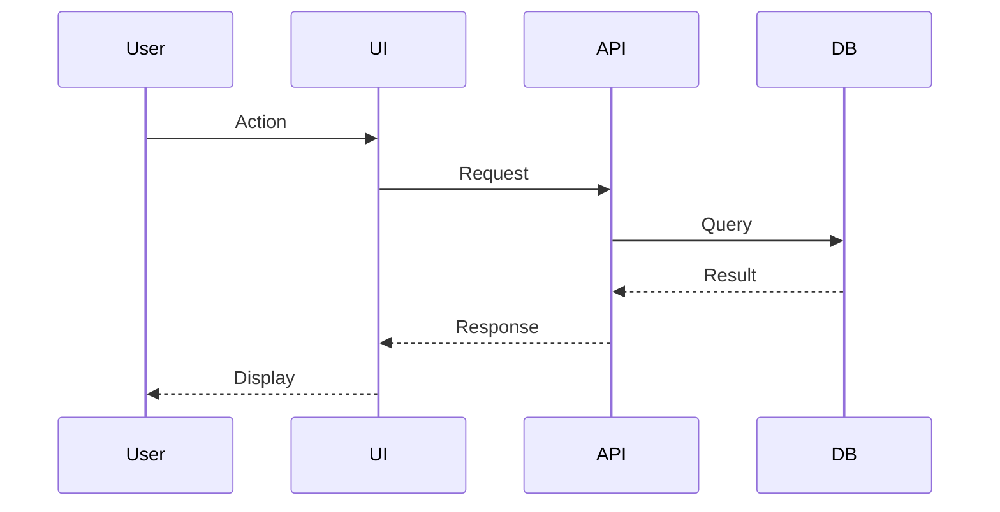

# Task Design - System Design

You are creating a system design document with architecture diagrams and API contracts.

## Arguments
$ARGUMENTS

## Current Context

1. Read `.claude/Tasks.md` to identify the current active task
2. Read requirements from `.claude/designs/radar-<ID>-requirements.md` if exists
3. Explore existing codebase architecture

## Output Location

Save design document to:
`.claude/designs/radar-<ID>-design.md`

## Design Document Template

```markdown
# System Design: [Task Title]
radar://[ID]

## Overview

### Purpose
[What problem does this solve?]

### Scope
[What's included and excluded]

### Goals
- [Goal 1]
- [Goal 2]

### Non-Goals
- [Non-goal 1]

---

## Architecture

### High-Level Architecture



### Component Diagram



### Sequence Diagram



---

## API Contracts

### Endpoint: [Name]

**Method:** `GET` / `POST` / `PUT` / `DELETE`
**Path:** `/api/v1/resource`

**Request:**
```json
{
  "field1": "string",
  "field2": 123
}
```

**Response (Success - 200):**
```json
{
  "data": {
    "id": "string",
    "result": "value"
  }
}
```

**Response (Error - 400):**
```json
{
  "error": {
    "code": "VALIDATION_ERROR",
    "message": "Description"
  }
}
```

---

## Data Models

### Entity: [Name]

```typescript
interface EntityName {
  id: string;
  field1: string;
  field2: number;
  createdAt: Date;
  updatedAt: Date;
}
```

### Database Schema

```sql
CREATE TABLE entity_name (
  id UUID PRIMARY KEY,
  field1 VARCHAR(255) NOT NULL,
  field2 INTEGER,
  created_at TIMESTAMP DEFAULT NOW(),
  updated_at TIMESTAMP DEFAULT NOW()
);
```

---

## File Structure

```
src/
├── components/
│   └── [new-component]/
│       ├── index.ts
│       ├── [Component].tsx
│       └── [Component].test.ts
├── services/
│   └── [new-service].ts
├── types/
│   └── [new-types].ts
└── utils/
    └── [new-util].ts
```

---

## Dependencies

### New Dependencies
| Package | Version | Purpose |
|---------|---------|---------|
| package-name | ^1.0.0 | Description |

### Existing Dependencies Used
- `existing-package` - For [purpose]

---

## Security Considerations

- [ ] Input validation
- [ ] Authentication required
- [ ] Authorization checks
- [ ] Data sanitization
- [ ] Rate limiting

---

## Performance Considerations

- [ ] Caching strategy
- [ ] Query optimization
- [ ] Lazy loading
- [ ] Bundle size impact

---

## Testing Strategy

### Unit Tests
- [Component/function to test]

### Integration Tests
- [Integration scenario]

### E2E Tests
- [User flow to test]

---

## Implementation Plan

### Phase 1: Foundation
1. [ ] Create base types/interfaces
2. [ ] Set up file structure

### Phase 2: Core Implementation
1. [ ] Implement [component/service]
2. [ ] Add [functionality]

### Phase 3: Integration
1. [ ] Connect components
2. [ ] Add error handling

### Phase 4: Testing
1. [ ] Unit tests
2. [ ] Integration tests

---

## Risks and Mitigations

| Risk | Impact | Mitigation |
|------|--------|------------|
| [Risk 1] | High/Med/Low | [Mitigation] |

---

## Open Questions

- [ ] [Question needing resolution]

---

## Appendix

### References
- [Link to relevant documentation]

### Glossary
- **Term**: Definition
```

## Design Process

### 1. Research Phase
```
1. Read existing codebase
2. Understand current architecture
3. Review similar implementations
4. Check for reusable components
```

### 2. Design Phase
```
1. Define high-level architecture
2. Design component interactions
3. Define API contracts
4. Create data models
5. Plan file structure
```

### 3. Review Phase
```
1. Check for consistency with existing patterns
2. Verify completeness
3. Identify risks
4. Document assumptions
```

## Output

1. Create design document in `.claude/designs/`
2. Update `.claude/Tasks.md` marking design complete
3. Summarize key design decisions

Now analyze the requirements and create the system design.
